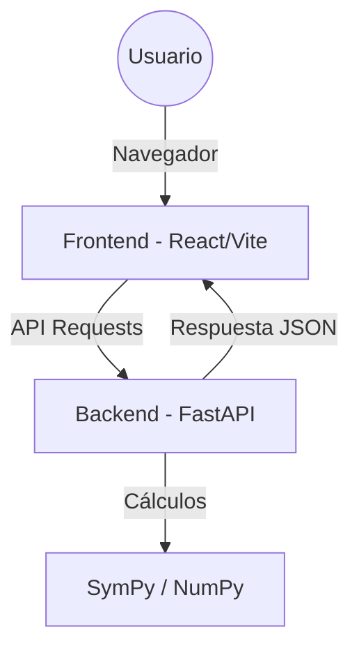

# <p align="center">🔬 Roooty Lab</p>

<p align="center">
  <strong>Plataforma Profesional de Análisis Numérico</strong><br>
  <i>Potencia, precisión y visualización en tiempo real.</i>
</p>

<p align="center">
  
  
  
  
  
</p>

---

## ✨ Características Principales

Roooty Lab es una herramienta integral para estudiantes e ingenieros que buscan resolver problemas complejos de análisis numérico con una interfaz moderna y amigable.

- 📈 **Visualización Interactiva**: Gráficos dinámicos con soporte para funciones trigonométricas y algebraicas.
- 🧪 **Métodos de Raíces**: Bisección, Regula Falsi, Newton-Raphson, Secante y Punto Fijo.
- 📊 **Análisis de Datos**: Regresión lineal con cálculo de correlación (R) y determinación (R²).
- 📑 **Reportes Pro**: Exportación de resultados a PDF con tablas de iteraciones detalladas.
- ⚡ **Alto Rendimiento**: Cálculos optimizados en el backend con Python y SymPy.
- 📱 **Responsive Design**: Totalmente funcional en tablets, móviles y PCs.

---

## 🚀 Cómo correrlo en tu PC (Paso a paso)

He diseñado este proceso para que sea **extremadamente sencillo**. Tienes dos formas de hacerlo:

### Opción A: La forma fácil (Recomendado 🐳)
*Ideal si no quieres instalar Python ni Node.js. Solo necesitas **Docker Desktop**.*

1. **Descarga el código**: Dale al botón verde de "Code" arriba y elige "Download ZIP", o clona el repo:
   ```bash
   git clone https://github.com/BautistaGenovese/Roooty.git
   cd Roooty
   ```
2. **Abre Docker Desktop**: Asegúrate de que el programa esté abierto.
3. **Lanza la app**:
   - La **primera** vez:
        ```bash
        docker compose up --build
        ```
   
   - Las siguientes veces: Solo abre Docker Desktop, entra a la carpeta del proyecto y ejecuta:
        ```bash
        docker compose up
        ```
5. **¡Listo!**: Abre tu navegador en [http://localhost](http://localhost).
- 🚦Para detener la app:
  
   ```bash
   docker compose down
   ```


---

### Opción B: La forma manual 🛠️
*Si prefieres correrlo sin Docker, necesitas tener instalados Python 3.11+ y Node.js.*

**1. Levanta el Backend (Primera vez):**
```bash
cd backend
python -m venv venv
# Windows:
.\venv\Scripts\activate
# Instala y corre:
pip install -r requirements.txt
uvicorn main:app --reload
```

**2. Levanta el Frontend (Primera vez):**
*Abre otra terminal nueva y haz esto:*
```bash
cd frontend
npm install
npm run dev
```
**¡Listo!**: Entra a [http://localhost:5173](http://localhost:5173).

### 🔄 **Las siguientes veces**:
**1. Backend:**
```bash
cd backend

# Windows
.\venv\Scripts\activate

uvicorn main:app --reload
```

**2. Frontend:**
*Abre otra terminal nueva y haz esto:*
```bash
cd frontend
npm run dev
```

**Roooty estará listo en**: [http://localhost:5173](http://localhost:5173).

---

## 🏗️ Arquitectura del Sistema



---

## 📂 Estructura del Proyecto

*   `backend/`: Lógica matemática, API REST y algoritmos numéricos.
*   `frontend/`: Interfaz de usuario, gráficos y componentes React.
*   `docker-compose.yml`: Configuración mágica para que todo funcione con un clic.


---

<p align="center">Hecho con ❤️ para la cátedra de Análisis Numérico.</p>
